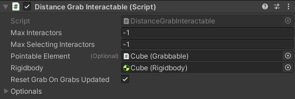
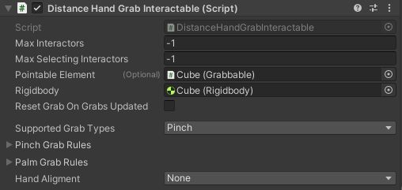
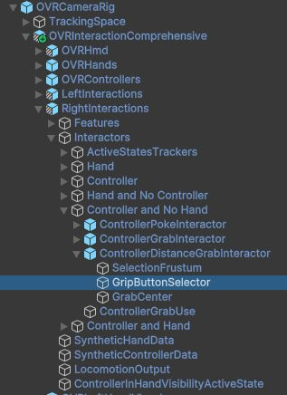

# MetaQuestで遠くにあるオブジェクトをつかむ

## 0. 本記事の内容

本記事ではMeta Questで遠くにある3Dオブジェクト(立方体)をつかんで操作するまでを紹介します。この動画はAR版ですがAR/VR両対応です。  
GitHubで公開している[サンプル](https://github.com/TakashiYoshinaga/MetaXR-SDK-Samples)の03-FarManipulationまたは03-FarManipulation-ARシーンでも動作を確認できます。

なお本記事は下記での事前準備が済んでいることを前提に解説を進めます。ご注意ください。

**[準備編]**

[MetaQuestでオブジェクトをつかむ(準備編)](5-quest-object-grab-preparation.md)

## 1. シーンの複製

前回の記事で作成したシーンを編集することも可能ですが、この既存のシーンを破壊せずにマニピュレーションを試すため、シーンを複製する方法を紹介します。不要な場合は読み飛ばしてください。

- 前回までに作成したManipulationもしくはNearManipulationのVR版またはAR版のシーンを開く
- **File -> Save As...** をクリックして現在のシーンを新しい名前で保存  
  *本記事では**FarManipulation**とします
- Hierarchyに表示されるシーン名がFarManipulationになっていることを確認

## 2. コントローラや手で遠くのオブジェクトをつかむ設定

オブジェクトをつかむ際にコントローラを使う場合と手を使う場合、それぞれの場合について追加するスクリプトとその設定方法を紹介します。両方の設定をすることでコントローラと手の両方を使用することも可能です。

**[コントローラでつかむ]**

- CubeのInspectorを表示し、Add Componentをクリック
- Grab Interactableで検索し、候補から**Distance Grab Interactable**を選択
- 追加されたDistance Grab Interactableの**Pointable Element**にCubeをドラッグ&ドロップ  
  *Distance Grab InteractableとGrabbalbeを接続し、コントローラでつかんだ情報をGrabbableで設定した挙動(位置・角度・スケールの変化)に反映
- さらにDistance Grab Interactableの**Rigidbody**にCubeをドラッグ&ドロップ  
  *前の記事でCubeに追加したRigidbodyを割り当てることでコントローラの先のポインタとCubeとの接触検知が利用される

**[手でつかむ]**

- CubeのInspectorを表示し、Add Componentをクリック
- Grab Interactableで検索し、候補から**Distance Hand Grab Interactable**を選択
- 追加されたDistance Hand Grab Interactableの**Pointable Element**にCubeをドラッグ&ドロップ  
  *Distance Hand Grab InteractableとGrabbalbeを接続し、手でつかんだ情報をGrabbableで設定した挙動(位置・角度・スケールの変化)に反映
- さらにDistance Hand Grab Interactableの**Rigidbody**にCubeをドラッグ&ドロップ  
  *前の記事でCubeに追加したRigidbodyを割り当てることで手の先のポインタとCubeとの接触検知が利用される

**[注意！]**

OVRCameraRigオブジェクトにアタッチされたOVR ManagerのHand Tracking Supportで**ControllerOnly**を選択しているとハンドトラッキングが動作しないためオブジェクトを手でつかむことができません。設定を必ず確認してください。

## 3. 現状確認と挙動の変更

以下の動画はここまでの操作でできたコンテンツの動作の様子です。(コントローラでつかむ場合は中指のグリップボタンを使用します。)

見ての通り遠くのオブジェクトを手元に引き寄せる挙動がMeta XR SDKのデフォルト設定となっていて、冒頭で提示したビデオでの挙動とは異なります。  
コンテンツによってはこれで問題ない場合もありますが、オブジェクトを手元に引き寄せずに位置だけを変えたいケースもあるので、これを実現する方法を紹介します。

**[つかまれた時のオブジェクトの挙動]**

- Cubeを選択しInspector下方のAdd Componentをクリック
- Move Fromで検索し、候補から**Move From Target Provider**を選択して追加

**挙動の違いについて:**
- **デフォルト**: オブジェクトがコントローラや手の位置に移動してから操作が始まる
- **変更後**: オブジェクトは元の位置を保ったまま操作できる

下記の手順で、Move From Target Providerを使ってオブジェクトが元の位置を保つように設定します。

**[コントローラ使用時の挙動調整]**

- Inspectorの**Distance Grab Interactable**に注目
- **Optionals**を開く
- **Movement Provider**にCubeをドラッグ&ドロップしてこのCubeに登録されたMove From Target Providerを関連付ける

**[手使用時の挙動調整]**

- Inspectorの**Distance Hand Grab Interactable**に注目
- **Reset Grab On Grabs Updated**を**OFF**
- **Optionals**を開く
- **Movement Provider**にCubeをドラッグ&ドロップしてこのCubeに登録されたMove From Target Providerを関連付ける

## 4. コントローラの設定の微調整 (オプション)

上記の操作によりコントローラでオブジェクトをつかんで動かすことが可能になりました。このときデフォルト設定ではグリップボタン(中指)を使用してつかむようになっています。これを例えばトリガーボタンでもつかめるようにする方法について紹介します。

- HierarchyのOVRCameraRigの子要素のOVRInteractionComprehensiveを開く
- さらに**RightInteractions -> Interactors -> Controller and No Hand -> ControllerDistanceGrabInteractor**の順に子要素を開く
- ControllerDistanceGrabInteractorの子要素の**GripButtonSelector**を開く
- GripButtonSelectorのInspectorで**ControllerSelector**に注目
- **Controller Button Usage**でTriggerButtonのチェックをON  
  *GripButtonが不要な場合はGripButtonのチェックを外す
- 左手のコントローラ(LeftInteractions)についても同様の操作を行うことで、つかむ際に使用するボタンを設定可能

## 5. 手の挙動の微調整 (オプション)

細かい話になりますが、デフォルト設定では両手でCubeを拡大縮小した際に、手のオブジェクトがCubeの方に飛んで行ってしまいます。もし手のオブジェクトを実際の手に追従させたい場合は下記を試してください。

- HierarchyのCubeを選択
- InspectorからCubeに登録されたDistance Hand Grab Interactableに注目
- **Hand Alignment**の設定を**None**に変更

## 6. 次のステップ

ここまでの内容で遠くのオブジェクトをつかんで操作する方法が実現できました。同じオブジェクトに対して遠くでの操作と近くでの操作を併用することもできます。

近くのオブジェクトの操作を追加する場合は、次の記事の2章からの手順をさらに追加してください。

[MetaQuestで近くにあるオブジェクトをつかむ](6-quest-near-object-grab.md)

## 7. Meta XR SDKに関する記事一覧はこちら

[Meta XR SDK連載目次](0-main.md)
