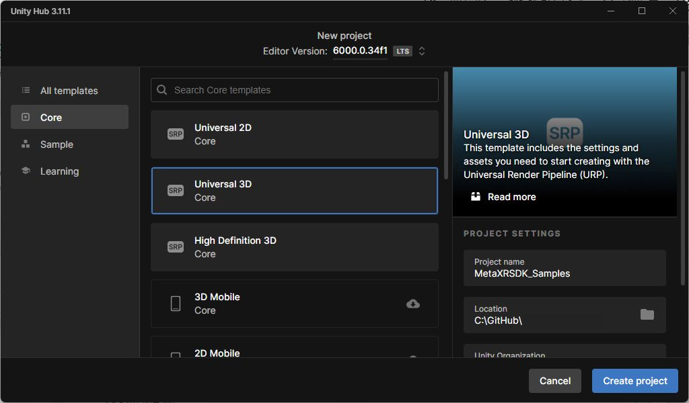
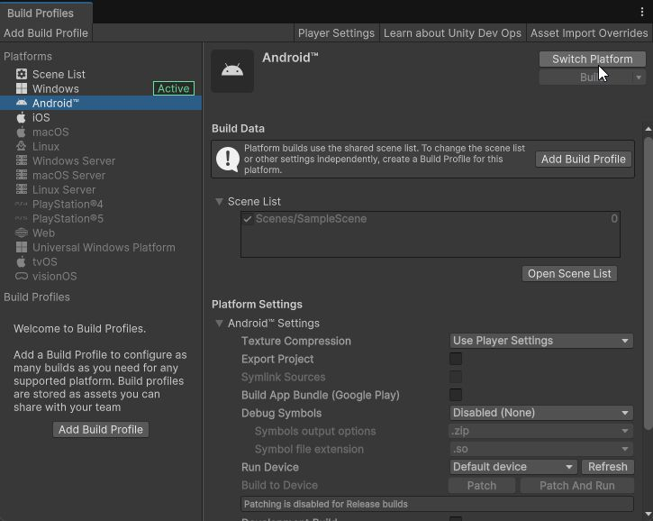
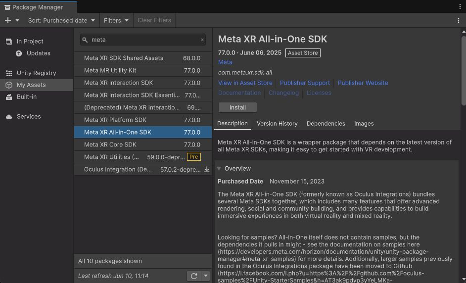
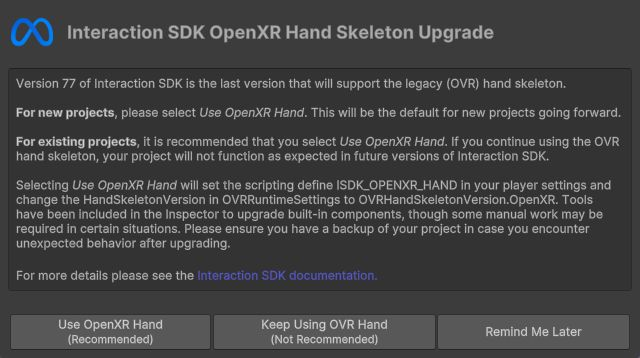
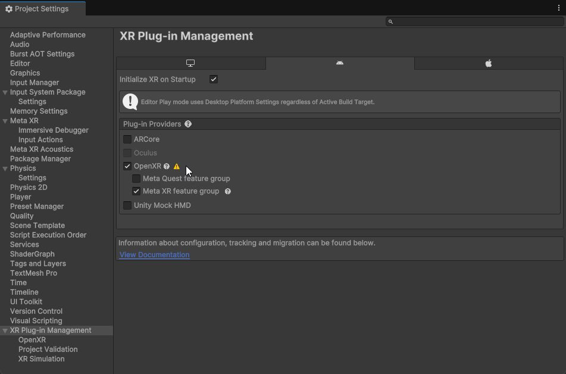

# Meta XR SDKのインストールとプロジェクトの設定

## 0. 本記事の内容

本記事ではMeta Quest対応のアプリケーションをUnityで開発するためのプロジェクト設定方法やSDKのインストール手順について紹介します。この記事の手順を完了することで、Meta XR SDKを使用したVR/ARアプリケーション開発の基盤が整います。

## 1. Unityプロジェクトの作成

**[新規プロジェクトの作成]**

- Unity Hubを開き**New project**をクリック
- New projectウィンドウ内でUnityのバージョンを選択  
  *本記事では**6000.0.34f**を使用  
  *Unityインストール時にAndroidの開発環境もインストールすること
- テンプレートの中から**Universal 3D**を選択
- Project SettingsでProject nameを設定  
  *本記事では**MetaXRSDK_Samples**と設定
- **Create project**をクリックしてプロジェクトを作成

**[Androidプラットフォームへの切り替え]**

- **File -> Build Profiles**をクリック
- Build Profilesウィンドウで**Android**を選択して**Switch Platform**をクリック

- 左の列の**Scene List**をクリック
- Scene ListからScenes/SampleSceneを右クリックで削除
- Build Settingsウィンドウを閉じる

## 2. Meta XR SDKのインストール

**[Asset Storeでマイアセットに登録]**

- Asset Storeの[Meta XR SDKのページ](https://assetstore.unity.com/packages/tools/integration/meta-xr-all-in-one-sdk-269657)を開きMeta XR All-in-One SDKを**My Assets**に追加  
  *Unityのページであらかじめ各自のアカウントでSign Inすること

**[Package Managerでのインストール]**

- Unity Editorに戻り、**Window -> Package Manager**をクリックしてPackage Managerを開く
- **My Assets**をクリックし検索ウィンドウで**Meta**と入力

- **Meta XR All in One SDK**を選択し、**Install**をクリック  
  *初めてこのアセットを利用する場合はまず**Download**をクリック。SDKのダウンロード終了後にインストール。
- インストール後、Editorの再起動を求められるので**Restart Editor**をクリック

- 再起動後、Interaction SDK OpenXR Upgradeウィンドウが表示されることがあるが現時点では無視して閉じる

## 3. OpenXR Pluginのインストール

- Unity Editor再起動後、再度Package Managerを開く
- **Unity Registry**をクリックし**OpenXR**で検索
- **OpenXR Plugin**をインストール
- Meta XR Feature Setに関する設定を促すダイアログが表示されるので**Yes**をクリック

- Project Settingsウィンドウが表示されるが今は無視でOK

## 4. Unity OpenXR Metaのインストール（オプション）

上記手順でインストールしたUnity OpenXRプラグインは、Depth APIオクルージョン機能をサポートしていません。Depth APIを使用する予定がある場合は下記手順でUnity OpenXR Metaをインストールしてください。

- Package Managerを開く
- **Unity Registry**をクリックし**OpenXR**で検索
- **Unity OpenXR Meta**をインストール

## 5. プロジェクトの設定

**[基本設定]**

- 念のためプロジェクトを一度閉じて再度開く
- Interaction SDK OpenXR Upgradeダイアログが表示されたら**Use OpenXR Hand**をクリック

**[XR Plugin Managementの設定]**

- **Edit -> Project Settings**を開く
- Project SettingsウィンドウでXR Plugin Managementをクリック
- **Android**タブを選択し、**OpenXR**のチェックをON (他はOFFでOK)
- Meta Quest Link(PC VR for Windows)を使用する場合は**Windows**タブからも**OpenXR**のチェックをONにする

**[Project Validationの実行]**

- XR Plugin Management直下の**Project Validation**をクリック
- **Android**タブを開き、タブ内の情報に表示されている**Fix All**をクリック  
*Fix Allクリック後、すぐに結果は反映されない場合があります。その場合は他の項目を開いて再度Project Validationに戻ってくるなどの方法で確認してみてください
- Meta Quest Linkを使用する場合は**Windows**タブからも同様の操作をする

**[Meta XR設定の検証]**

- **Meta XR**をクリック
- **Android**タブを開き、Outstanding Issues横の**Fix All**をクリック
- Meta Quest Linkを使用する場合は**Windows**タブからも同様の操作をする

**[AndroidManifest.xmlの作成]**

- Project Settingsウィンドウを閉じる
- Unity Editorのメニューバーにて**Meta -> Tools**をクリック
- **Create store-compatible AndroidManifest.xml**をクリック
- 上書きの許可を求められたら**Replace**をクリック

## 6. ビルド設定（オプション）

この操作は独自のアプリ名（パッケージ名）を設定するものです。必須ではありませんが、複数のアプリを開発する場合は設定することをお勧めします。

**[アプリ情報の設定]**

- **Edit -> Project Settings**を開く
- **Player**を選択
- **Company Name**と**Product Name**を設定

**[パッケージ名の設定]**

- 少し下の方に表示されているタブから**Android**を選択
- **Other Settings**を開く
- IdentificationのOverride Default Package Nameのチェックを**OFF**

## 7. 次のステップ

ここまでの内容でプロジェクトの基本的な設定が完了しました。次はVRで3Dオブジェクトを表示する方法について解説します。

[MetaQuestでオブジェクトを表示](2-quest-vr-object-display.md)

## 8. Meta XR SDKに関する記事一覧はこちら

[はじめようMeta XR SDKでQuestアプリ開発](0-main.md)
