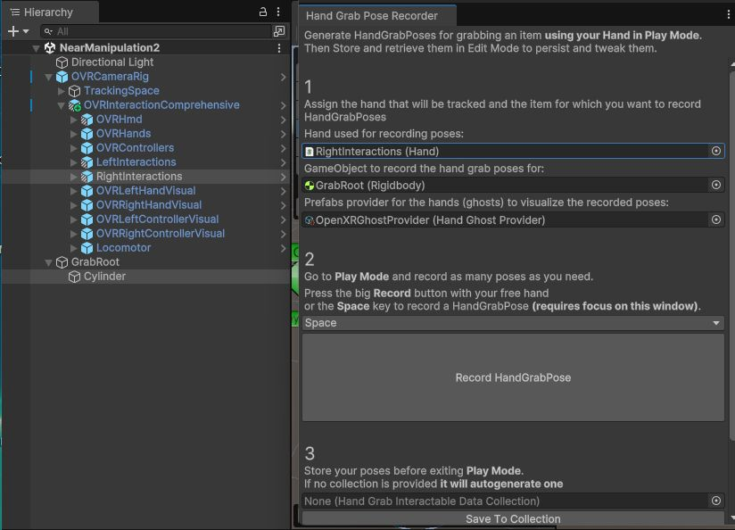
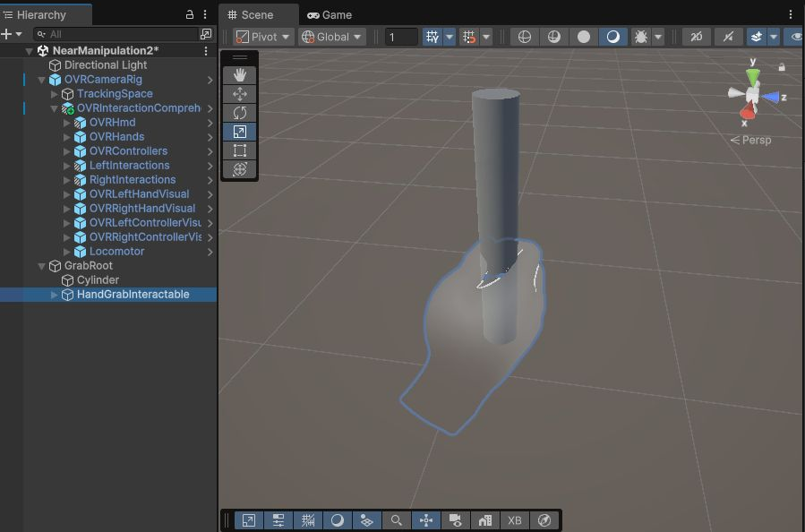

# MetaQuestでHand Poseを用いたオブジェクトマニピュレーション

## 0. 本記事の内容

過去の記事では基本的なハンドマニピュレーションの実装方法を紹介しましたが、実際のアプリケーションではより自然で直感的な操作感が求められます。本記事では、Hand Poseを活用してオブジェクトと手の相対的な位置関係を記録し、現実世界での物の持ち方を忠実に再現するマニピュレーション手法について解説します。この機能により、ツールや楽器など特定の持ち方が重要なオブジェクトを、より現実に近い感覚で操作することが可能になります。  
GitHubで公開している[サンプル](https://github.com/TakashiYoshinaga/MetaXR-SDK-Samples)の06-HandPoseManipulationまたは06-HandPoseManipulation-ARシーンでも動作を確認できます。

なお本記事はQuestLinkを使用するためWindows環境での開発を前提とします。

   
*この動画はAR版ですがAR/VR両対応です。

なお本記事は下記で作成したVRまたはARのシーンをベースに解説を進めます。

**[VR版]**

[MetaQuestでオブジェクトを表示](https://tks-yoshinaga.hatenablog.com/entry/quest-dev-vr)

**[AR版]**

[MetaQuestのパススルーを使ったAR表示](https://tks-yoshinaga.hatenablog.com/entry/quest-dev-ar)

## 1. シーンを複製

前回の記事で作成したシーンを編集することも可能ですが、この既存のシーンを破壊せずにHand Poseマニピュレーションを試すため、シーンを複製する方法を紹介します。不要な場合は読み飛ばしてください。

- VRまたはAR対応済みのシーンを開く
- File -> Save As... をクリックして現在のシーンを新しい名前で保存  
  *本記事ではHandPoseManipulationとします
- Hierarchyに表示されるシーン名がHandPoseManipulationになっていることを確認

## 2. オブジェクトの準備

Hand Poseマニピュレーションのデモンストレーション用にCylinderオブジェクトを使用します。

- HierarchyからCubeを削除
- 何も選択されていない状態でHierarchyの空白を右クリック
- 3D Object -> Cylinderをクリック

## 3. Hand Poseマニピュレーション用のオブジェクト構造作成

手に沿ってマニピュレーションを行うには、以前の記事で紹介したGrabbableとHand Grab Pose RecorderGameObjectを使用しますが、マニピュレーション対象となるオブジェクトはその時のものと少々異なる構造の設定が必要になります。具体的には親となるGrabRootオブジェクトを作成し、その子要素としてCylinderを配置します。

- Hierarchyの空白を右クリック
- Create Emptyをクリック
- 作成されたGameObjectの名前を**GrabRoot**に変更

**[GrabRootオブジェクトの設定]**

- GrabRootオブジェクトの位置やサイズを下記のように変更  
  Position: **0 1.3 0.4**  
  Rotation: **0 0 0**  
  Scale: **1 1 1**  
  *RootのScaleは必ず1にすること

**[Cylinderの配置]**

- CylinderをGrabRootの子要素になるようにドラッグして移動

- Cylinderオブジェクトの位置やサイズを下記のように変更  
  Position: **0 0 0**  
  Rotation: **0 0 0**  
  Scale: **0.03 0.1 0.03**

## 4. マニピュレーション機能の基本設定

**[物理挙動の設定]**

- GrabRootをクリック
- Inspector内のAdd Componentをクリック
- **Rigidbody**を検索して追加  
  *これは前述の通り接触判定で使用
- RigidBodyのUse GravityとIs Kinematicを下記のように設定  
  **Use Gravity: OFF**  
  **Is Kinematic: ON**

**[マニピュレーション機能の追加]**

- GrabRootのInspectorのAdd Componentから**Grabbable**を検索して追加  
  *これも前述の通りマニピュレーション可能にするために使用

## 5. 手の形状データの作成

ここではオブジェクトを追従させたい手の形状に関する情報の作成とマニピュレーション機能の追加を行います。手の形状のデータの作成にはSDKが提供するツールを使用します。

**[Hand Grab Pose Recorderの起動]**

- メニューバーの**Meta**をクリック
- **Interaction -> Hand Grab Pose Recorder**の順にクリック
- Hand Grab Pose Recorderダイアログの**1**に注目
- **Hand used for recording poses**で形状を記録したい手(例: RightInteractions)を選択
- **GameObject to record the hand grab poses for**で**GrabRoot**を選択

## 6. 手の形状の記録

**[記録の準備]**

- QuestとPCをLinkケーブルで接続
- Quest内でQuest Linkを起動
- Unity EditorのPlayボタンをクリック

**[手の形状の記録]**

- Cylinderをつかむ真似をした状態でキーボードの**Spaceキー**を押下
- 手の形状が記録されます

**[記録データの保存]**

- PlayモードのままHand Grab Pose Recorderに戻り**Save To Collection**をクリック
- 手の形状を記録したファイルが保存される
- Playモードを停止
- 最後に**Load From Collection**をクリック
- GrabRootの子要素に**HandGrabInteractable**が自動で追加される

## 7. マニピュレーション機能の調整

ここまでの操作でハンドマニピュレーションは可能になりましたが、現在は手でつかむだけでなく指でつまむ(ピンチ)でもつかめてしまいます。またマニピュレーションは右手にしか対応していません。そこでこれらを解消する手順を追加します。

**[つかみ方の制限]**

- GrabRootの子要素のHandGrabInteractableオブジェクトをクリック
- Inspector内で**Supported Grab Types**を見つける
- この内容を**All**ではなく**Palm**に変更  
  *これによりピンチでのマニピュレーションを無効化し、手のひらでのつかみのみに制限

**[左手対応の追加]**

- Inspector下方にある**Create Mirrored HandGrabInteractable**をクリックし左手のInteractableも作成  
  *これにより左手でも同様のマニピュレーションが可能になります

## 8. 動作確認

**[Meta Quest Linkを使用する場合(Windows)]**

詳細は[公式ページ](https://www.meta.com/ja-jp/help/quest/articles/headsets-and-accessories/oculus-link/set-up-link/)をご覧ください。

- QuestとPCをUSBケーブルで接続
- Quest内でQuest Linkを起動
- Unity EditorのPlayボタンをクリック
- 記録した手の形状でCylinderをつかんでみてください。オブジェクトが手の形状に合わせて自然につかめることが確認できるはずです

**[実機にインストールする場合]**

- QuestとPCをUSBケーブルで接続
- Unity EditorでFile -> Build Settingsをクリック
- Build And Runをクリック
- インストーラ(apk)名を半角英数で設定して保存
- インストーラの生成とインストールが終わると自動的にQuest内でアプリが起動します

## 9. さらなるカスタマイズ

Hand Grab Pose Recorderを使用することで、より複雑な手の形状や複数の持ち方を記録することも可能です。例えば：

- 同じオブジェクトに対して複数の持ち方を記録
- 異なる手の大きさに対応した形状の記録
- より自然な手の動きに合わせた細かな調整

これらの詳細については、Hand Grab Pose Recorderの各種設定オプションを確認してください。

## 10. Meta XR SDKに関する記事一覧はこちら

[はじめようMeta XR SDKでQuestアプリ開発](https://tks-yoshinaga.hatenablog.com/entry/quest-dev-index)
