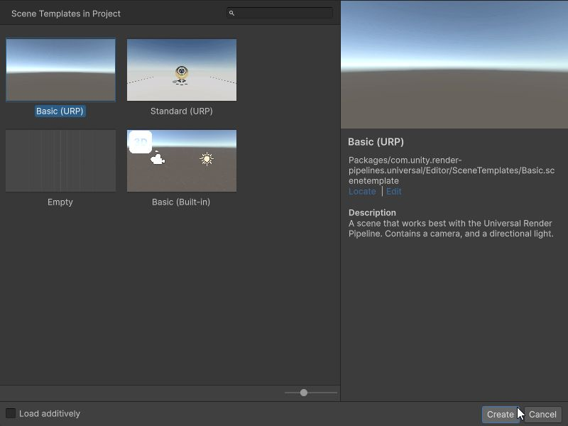
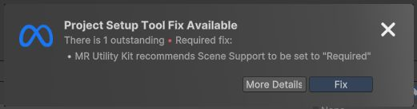
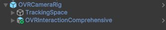
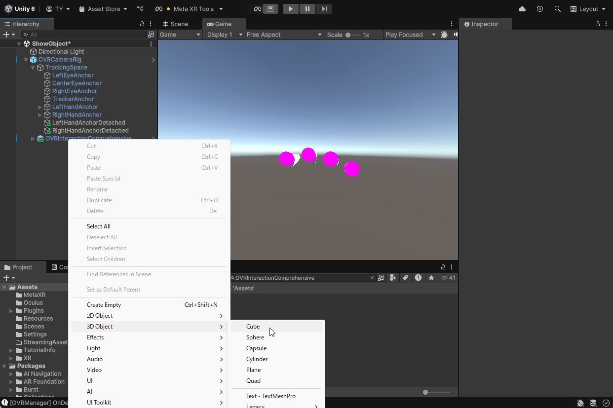

# MetaQuestでオブジェクトをVR表示

## 0. 本記事の内容

本記事ではMeta Questで3Dオブジェクト（立方体）をVRで表示するまでの手順を紹介します。Meta XR SDKの基本的なカメラ設定からオブジェクトの配置、実機での動作確認まで、VRアプリケーションの基礎となる内容を学習できます。  
GitHubで公開している[サンプル](https://github.com/TakashiYoshinaga/MetaXR-SDK-Samples)の01-ShowObjectシーンでも動作を確認できます。

なお本記事は下記の続きとなります。設定等に違いがないかご確認ください。

[Meta XR SDKのインストールとプロジェクトの設定](https://tks-yoshinaga.hatenablog.com/entry/quest-dev-setup)

## 1. シーンの作成

**[新しいシーンの作成]**

- **File -> New Scene**をクリック
- New Sceneウィンドウで**Basic(URP)**を選択し**Create**をクリック

- **File -> Save**をクリック
- シーン名を設定し保存  
  *本記事では**ShowObject**とする

## 2. Quest用のカメラの設定

**[カメラリグの配置]**

- Hierarchy内の**Main Camera**を削除
- Projectタブの検索エリアに**CameraRig**と入力
- 検索エリア直下のSearch:から**All**を選択
- **OVRCameraRig**をHierarchyにドラッグ&ドロップ
- Project Setup Tool Fix Availableが表示された場合はFixをクリック

**[OVR Managerの設定]**

- Hierarchy内のOVRCameraRigをクリック
- InspectorでQuestに関する詳細情報を設定する**OVR Manager**を見つける
- Trackingの項目内の**Tracking Origin Type**で**Floor Level**を選択  
  *Tracking Origin Typeは原点の高さを決めるうえで重要となります

| モード | 説明 |
|--------|------|
| **Floor Level** | 床面の高さが原点 |
| **Eye Level** | アプリが起動した時のQuestの高さが原点 |

*オブジェクトの表示高さを部屋に対して固定したい場合は**Floor Level**を選択し、Questの初期位置に対してオブジェクトを固定したい場合は**Eye Level**を選択します。

## 3. コントローラや手の表示

本記事では手やコントローラを使ったインタラクションを紹介しませんが、この後に続く記事でこれらを使用します。また、手やコントローラがQuestによって認識されていることが動作確認の段階で視覚的に確認できると楽しいため、設定手順を紹介します。

**[インタラクション機能の追加]**

- Projectタブの検索エリアに**OVRInteractionComprehensive**と入力
- 検索エリア直下のSearch:から**All**を選択
- **OVRInteractionComprehensive**をOVRCameraRigにドラッグアンドドロップし、子要素として追加

**[ハンドトラッキングの設定]**

- Hierarchy内のOVRCameraRigをクリック
- InspectorでQuestに関する詳細情報を設定する**OVR Manager**を見つける
- Quest Featuresの項目の中から**Hand Tracking Support**を見つけて、好みのモードを選択  
*本連載では**Controllers and Hands**を選択していることを前提とします。

| 設定名 | 説明 |
|--------|------|
| **Controllers Only** | コントローラのみが動作しハンドトラッキングは無効 |
| **Controllers and Hands** | コントローラとハンドトラッキングの両方が動作 |
| **Hands Only** | ハンドトラッキングのみが動作 |

## 4. オブジェクトの配置

**[立方体の作成]**

- 他のオブジェクトを選択していない状態でHierarchyの空白を右クリック
- **3D Object -> Cube**をクリック

**[位置とサイズの調整]**

- Hierarchy内に追加されたCubeをクリック
- InspectorのTransformでCubeの位置・角度・サイズを設定  
  *本記事では下記の設定で床から1.3mの高さ、原点から1m向こう側に、少し傾いた0.3m相当の立方体を表示

| 項目 | X | Y | Z |
|------|---|---|---|
| **Position** | 0 | 1.3 | 1 |
| **Rotation** | 0 | 20 | 0 |
| **Scale** | 0.3 | 0.3 | 0.3 |

## 5. 動作確認

**[実機にインストールする場合]**

- QuestとPCをUSBケーブルで接続
- Unity EditorでFile -> Build Settingsをクリック
- **Build And Run**をクリック
- インストーラ(apk)名を半角英数で設定して保存
- インストーラの生成とインストールが終わると自動的にQuest内でアプリが起動します
- 立方体が目の前に表示されるはずです。目の前とは異なる方角に表示される場合は右コントローラの**meta (oculus)ボタン**を長押しして方位をリセットしてください
- インストールでエラーが出る場合は設定を見直すか、一度Buildでapkだけ作成して[SideQuest](https://sidequestvr.com/setup-howto)や[MetaQuestDeveloperHub](https://developer.oculus.com/documentation/unity/ts-odh/?locale=ja_JP)からアプリをインストールしてください

**[Meta Quest Linkを使用する場合（Windows）]**

詳細は[公式ページ](https://www.meta.com/ja-jp/help/quest/articles/headsets-and-accessories/oculus-link/set-up-link/)をご覧ください。

- QuestとPCをUSBケーブルで接続
- Quest内でQuest Linkを起動
- Unity EditorのPlayボタンをクリック
- 立方体が目の前に表示されるはずです。目の前とは異なる方角に表示される場合は右コントローラの**meta (oculus)ボタン**を長押しして方位をリセットしてください

## 6. 次のステップ

ここまでの内容でVRでの基本的なオブジェクト表示が実現できました。次はパススルー機能を使ったAR表示について解説します。

[MetaQuestのパススルーを使ったAR表示](3-quest-ar-passthrough.md)

## 7. Meta XR SDKに関する記事一覧はこちら

[はじめようMeta XR SDKでQuestアプリ開発](0-main.md)
