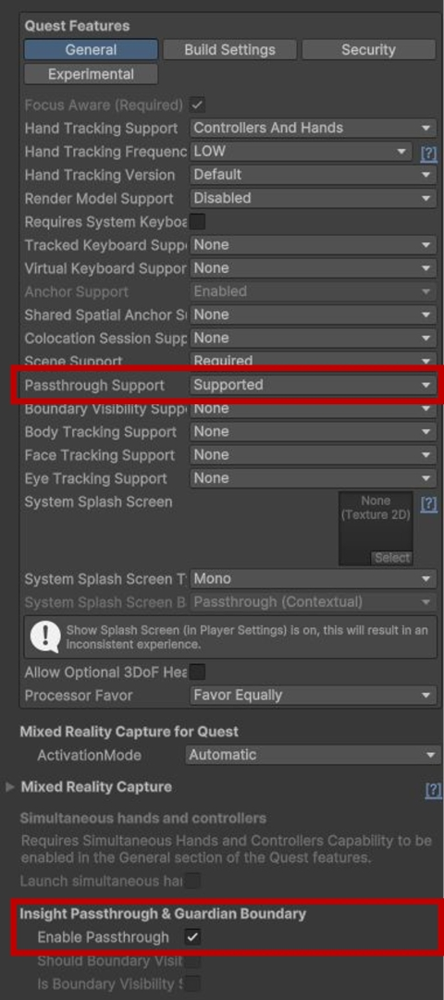
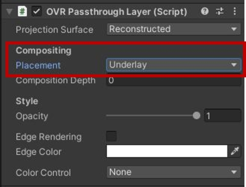
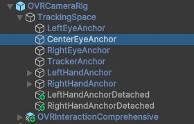

# MetaQuestのパススルー機能を使ったAR表示

## 0. 本記事の内容

本記事ではMeta Questで3Dオブジェクト（立方体）をAR表示するまでの手順を紹介します。パススルー機能の設定から背景の透明化まで、現実世界に仮想オブジェクトを重畳表示するための基本的な手法を学習できます。  
GitHubで公開している[サンプル](https://github.com/TakashiYoshinaga/MetaXR-SDK-Samples)の01-ShowObject-ARシーンでも動作を確認できます。

なお本記事は下記で作成したシーンを編集してAR化します。まずはこちらをお読みください。ただし既にMeta XR SDKを使ったVRのシーンをお持ちの場合は下記記事の確認は不要です。

[MetaQuestでオブジェクトを表示](2-quest-vr-object-display.md)

## 1. シーンを複製

前回の記事で作成したシーンを編集することも可能ですが、この既存のシーンを破壊せずにAR化を試すため、シーンを複製する方法を紹介します。不要な場合は読み飛ばしてください。

- AR化したいシーンを開く  
*本記事では前回作成したVRシーンのShowObject
- **File -> Save As...** をクリックして現在のシーンを新しい名前で保存  
*本記事では**ShowObject-AR**とします
- Hierarchyに表示されるシーン名がShowObject-ARになっていることを確認

## 2. パススルー機能の有効化

**[OVR Managerでのパススルー設定]**

- Hierarchy内で**OVRCameraRig**を選択
- Inspectorに表示される詳細情報の中から**OVR Manager**を見つける
- Quest Featuresの項目の中の**Passthrough Support**を**Supported**または**Required**に変更
- Insight Passthrough & Guardian Boundaryという項目の中の**Enable Passthrough**のチェックを**ON**にする

**[パススルーレイヤーの追加]**

ここまでの操作でパススルーの機能そのものはONになりますが、このままではパススルー映像は表示されないため、下記の手順で映像を表示するためのレイヤーを追加します。

- OVRCameraRigのInspectorの一番下の**Add Component**をクリック
- 検索エリアで**Passthrough**で検索
- **OVRPassthroughLayer**をクリック
- Inspectorに追加されたOVRPassthroughLayerの中の**Placement**を**Underlay**に変更

## 3. カメラの背景設定

上記の手順でパススルー表示の準備は概ね整いましたが、実はこのままビルドしてもSkyboxしか表示されずAR化されません。最後にカメラの背景描画設定を変更してパススルー映像を表示できるようにします。

**[CenterEyeAnchorの設定]**

- Hierarchy内でOVRCameraRigの子要素の**TrackingSpace**を開く
- TrackingSpaceの子要素の**CenterEyeAnchor**を選択

**[背景の透明化]**

- Inspector内でCameraを見つけ**Background Type**を**Skybox**から**Solid Color**に変更
- Backgroundの項目で色を**RGBA全て0**に変更  
  *特に**A（アルファ値）を0**にして透過させることが重要

| 設定項目 | 設定値 |
|----------|--------|
| **Background Type** | Solid Color |
| **Background R** | 0 |
| **Background G** | 0 |
| **Background B** | 0 |
| **Background A** | 0 |

## 4. 動作確認

**[実機にインストールする場合]**

- QuestとPCをUSBケーブルで接続
- Unity EditorでFile -> Build Settingsをクリック
- **Build And Run**をクリック
- インストーラ(apk)名を半角英数で設定して保存
- インストーラの生成とインストールが終わると自動的にQuest内でアプリが起動します
- 立方体が現実世界に重畳表示されるはずです。目の前とは異なる方角に表示される場合は右コントローラの**meta (oculus)ボタン**を長押しして方位をリセットしてください
- インストールでエラーが出る場合は設定を見直すか、一度Buildでapkだけ作成して[SideQuest](https://sidequestvr.com/setup-howto)や[MetaQuestDeveloperHub](https://developer.oculus.com/documentation/unity/ts-odh/?locale=ja_JP)からアプリをインストールしてください

**[Meta Quest Linkを使用する場合（Windows）]**

詳細は[公式ページ](https://www.meta.com/ja-jp/help/quest/articles/headsets-and-accessories/oculus-link/set-up-link/)をご覧ください。

- QuestとPCをUSBケーブルで接続
- Quest内でQuest Linkを起動
- Unity EditorのPlayボタンをクリック
- 立方体が現実世界に重畳表示されるはずです。目の前とは異なる方角に表示される場合は右コントローラの**meta (oculus)ボタン**を長押しして方位をリセットしてください

## 5. 次のステップ

ここまでの内容でAR表示の基本が実現できました。ただし、現状ではコントローラによるワープ（テレポート）やターン（視点回転）が有効になったままです。これらの機能はVRでは便利ですが、ARでは現実空間との整合性を損なう可能性があります。

より自然なAR体験を実現するため、次はこれらのロコモーション機能を無効化する方法について解説します。

[MetaQuestのロコモーションをオフにする](4-quest-locomotion-disable.md)

## 6. Meta XR SDKに関する記事一覧はこちら

[Meta XR SDK連載目次](0-main.md)
