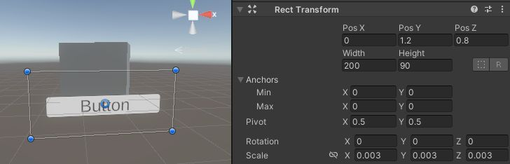
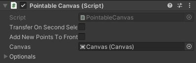
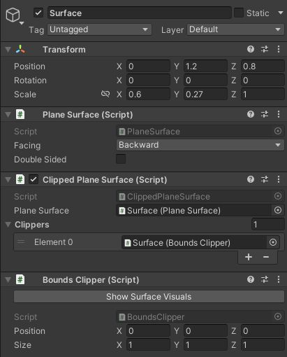
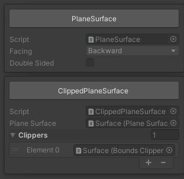

# MetaQuestでUnityのUI操作

## 0. 本記事の内容

Meta QuestでUnityのUIを操作する例としてボタン操作の方法を紹介します。本記事ではまず手やコントローラがボタンと相互作用できることを確認し、そのあとインタラクションの一例としてボタンを押したタイミングでCubeを消す方法を解説します。  
GitHubで公開している[サンプル](https://github.com/TakashiYoshinaga/MetaXR-SDK-Samples)の05-UiInteractionまたは05-UiInteraction-ARシーンでも動作を確認できます。

*この動画はAR版ですがAR/VR両対応です。

なお本記事は下記で作成したVRまたはARのシーンで表示している立方体を操作することを前提としています。立方体に特別なコンポーネントが追加されていない、Questで眺めるだけの状態からのスタートとなりますので、他のプロジェクトでも同様の状況であれば本記事と続きの記事の内容を実践することでオブジェクト操作を実現できます。

**[VR版]**

[MetaQuestでオブジェクトを表示](2-quest-vr-object-display.md)

**[AR版]**

[MetaQuestのパススルーを使ったAR表示](3-quest-ar-passthrough.md)  

## 1. シーンを複製

上記の記事で作成したシーンを編集することも可能ですが、この既存のシーンを破壊せずにUI操作を試すため、シーンを複製する方法を紹介します。不要な場合は読み飛ばしてください。

- 上記で作成したVR版またはAR版のシーンを開く
- File -> Save As... をクリックして現在のシーンを新しい名前で保存  
  *本記事では**UiInteraction**とします
- Hierarchyに表示されるシーン名がUiInteractionになっていることを確認

## 2. UIの作成

ボタンを作成し、3次元空間に配置します。

**[ボタンの作成]**

- Hierarchyの空白を右クリック
- **UI -> Button - TextMeshPro**をクリック
- TMP Importer(Text Mesh Proのインストーラー)が表示されたら**Import TMP Essentials**をクリック
- TMP Importerを閉じる
- CanvasとEventSystemが追加されていることを確認

**[3D空間への配置設定]**

- Canvasを選択しInspectorでCanvasコンポーネントを見つける
- CanvasのRender Modeを**World Space**に変更  
  *UIはデフォルトでは画面上に配置されますが、この変更により3D空間に配置されるようになります
- Canvasの子要素のButtonの**PosX**と**PosY**を**0**に変更
- CanvasのInspectorのパラメータを操作してUIのサイズを下記のように調整  
  **Position**   X: **0**   Y: **1.2**   Z: **0.8**  
  **Size**       Width: **200**   Height: **90**  
  **Scale**      X: **0.003**   Y: **0.003**   Z: **0.003**  
  *図中の白い枠がCanvasのエリアを表しています

## 3. CanvasをQuest対応にする

現段階ではUIを作っただけで、Meta Questで使用するコントローラや手とのインタラクションができないため、基本的なインタラクション設定を行います。

**[Pointable Canvasの設定]**

- Canvasをクリックし、Inspector下方の**Add Component**をクリック
- **Pointable**で検索し、候補に表示される**Pointable Canvas**をクリックして追加
- 追加されたPointable CanvasのCanvasの右のエリアにHierarchy内の**Canvas**オブジェクトをドラッグ&ドロップ

**[EventSystemの設定]**

- HierarchyでEventSystemを選択
- Add Componentをクリックし、**Pointable Canvas**で検索
- **Pointable Canvas Module**をクリックして追加  
  *通常の入力ではなくMetaが提供するPointable Canvasへの入力を使用
- Pointable Canvas ModuleのExclusive Modeチェックを**ON**

## 4. 3D空間でのUI判定領域設定

Meta XR SDKでは、UI（Canvas）と手やコントローラとの相互作用のために、3次元空間での判定領域を別途設定する必要があります。

**[接触判定用オブジェクトの作成]**

- Hierarchyの何もない空白を右クリックし**Create Empty**をクリック
- 生成されたGameObjectの名前を**Surface**とする  
  *名前は何でもOK
- SurfaceをクリックしてTransformに注目
- Surfaceオブジェクトの位置とサイズをCanvasと同じにする  
  **Position**   X: **0**   Y: **1.2**   Z: **0.8**  
  **Scale**      X: **0.6**   Y: **0.27**   Z: **1**  
  *ScaleはCanvasのWidth × Scale(x), Height × Scale(Y)で算出。Zは何でもOK  
  *Canvasに対して多少大きくしたり小さくしたりしてもOK

**[Surface関連コンポーネントの追加]**

- SurfaceのInspectorの**Add Component**をクリック
- **Plane Surface**で検索し、**Plane Surface**をクリックして追加  
  *これによってSurfaceの位置（=Canvasの位置）の平面がポインタと接触する準備が整います

- SurfaceのInspectorの**Add Component**をクリック
- 候補から**Clipped Plane Surface**をクリックして追加  
  *クリッピング領域でのみポインタとの接触判定が行われるようになります

- SurfaceのInspectorの**Add Component**をクリック
- **Bounds**で検索し**Bounds Clipper**をクリックして追加  
  *クリッピング領域を設定するスクリプトが追加されます

**[コンポーネント間の関連付け]**

- Clipped Plane SurfaceのPlane Surfaceに注目
- Surfaceオブジェクトをドラッグ&ドロップ  
  *Surfaceオブジェクトの平面に対してクリッピングを適用します
- Clipped Plane SurfaceのClippersを開き + ボタンをクリック
- Element 0にSurfaceオブジェクトをドラッグ&ドロップ  
  *Bounds Clipperで設定した領域でクリッピングします

**[オプション]**
- 最後にSufraceオブジェクトをCanvasにドラッグ&ドロップして子要素にします
- 念のため子要素になったSurfaceのPositionが0 0 0であることを確認

## 5. インタラクション方式の選択

UIがコントローラや手から出るRayに反応するか、近くで直接UIに触れるPoke操作に反応するかを設定します。どちらか一方でも両方設定してもOKです。

**[Rayを使った遠隔操作]**

- Canvasをクリックし、Inspector下方の**Add Component**をクリック
- **Ray Interactable**で検索し、候補に表示される**Ray Interactable**を追加
- 追加されたRay Interactableの**Pointable Element**に**Canvas**オブジェクトをドラッグ&ドロップ  
  *Rayでの操作とPointable CanvasをリンクさせてCanvas内のUI操作を可能にします
- Ray InteractableのSurfaceに**Surface**オブジェクトをドラッグ&ドロップ
- ダイアログが表示されたら**ClippedPlaneSurface**を選択  
  *Clipped Plane Surfaceで設定された領域のみでインタラクションを可能にします

**[Pokeを使った近接操作]**

- Canvasをクリックし、Inspector下方の**Add Component**をクリック
- **Poke Interactable**で検索し、候補に表示される**Poke Interactable**を追加
- 追加されたPoke Interactableの**Pointable Element**に**Canvas**オブジェクトをドラッグ&ドロップ  
  *Pokeでの操作とPointable CanvasをリンクさせてCanvas内のUI操作を可能にします
- Poke InteractableのSurface Patchに**Surface**オブジェクトをドラッグ&ドロップ
- ダイアログが表示されたら**ClippedPlaneSurface**を選択  
  *Clipped Plane Surfaceで設定された領域のみでインタラクションを可能にします

**[基本的なインタラクション確認]**

ここまでの操作でボタンとのインタラクションが可能になります。動作確認をすると以下の動画のようにボタンをクリックしたタイミングでボタンの色が少し変わっていることが確認できます。

## 6. ボタンイベントの設定

ここでの設定はMeta XR SDKに特化したものではなくUnityの一般的なUIの挙動に関するものです。ここでは一例として、ボタンを押したタイミングでCubeを消してみましょう。

- Buttonをクリックし、InspectorでOn Clickを見つける
- 右下の + ボタンをクリック
- 新たに追加された領域のNoneと書かれた箇所に**Cube**をドラッグ&ドロップ
- No Functionと書かれたドロップダウンメニューを開く
- **GameObject -> SetActive**をクリック
- チェックボックスが**OFF**になっていることを確認  
- これによってボタン押下時にCubeが非アクティブになります

## 7. 動作確認

**[実機にインストールする場合]**

- QuestとPCをUSBケーブルで接続
- Unity EditorでFile -> Build Settingsをクリック
- Build And Runをクリック
- インストーラ(apk)名を半角英数で設定して保存

**[Meta Quest Linkを使用する場合(Windows)]**

- QuestとPCをUSBケーブルで接続
- Quest内でQuest Linkを起動
- Unity EditorのPlayボタンをクリック

RayでもPokeでもボタンをクリックしたタイミングでCubeが消えることが確認できます。

## 8. Meta XR SDKに関する記事一覧はこちら

[はじめようMeta XR SDKでQuestアプリ開発](0-main.md)