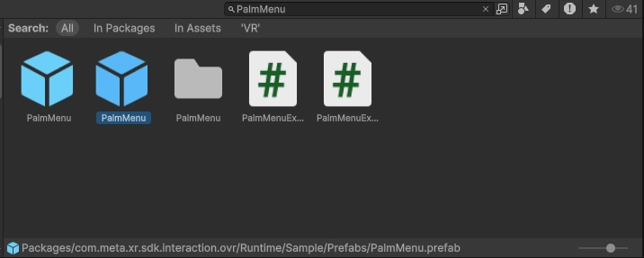
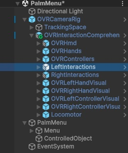
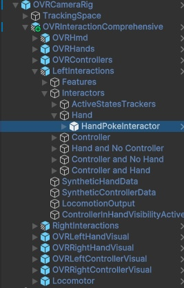
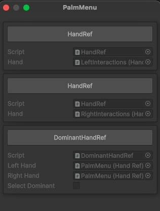
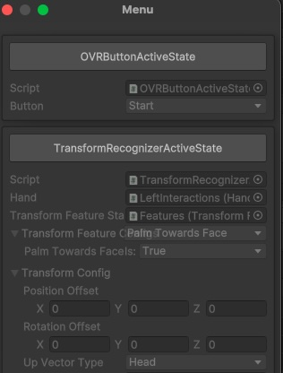
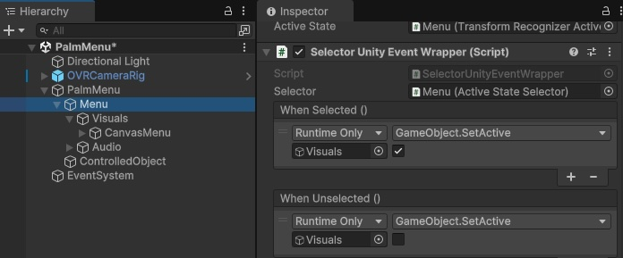

# MetaQuestでPalmMenuを使った手のひらUI

## 0. 本記事の内容

本記事ではMeta Questで手のひらの上にUIを表示し、もう一方の指で操作するPalmMenuの実装方法を紹介します。PalmMenuは手のひらを実際になぞったりタップしたりして操作するため、空中に浮いたUIよりも触覚に訴える自然なインタラクションを実現できる非常に有用な機能です。  
GitHubで公開している[サンプル](https://github.com/TakashiYoshinaga/MetaXR-SDK-Samples)の07-PalmMenuまたは07-PalmMenu-ARシーンでも動作を確認できます。

*この動画はAR版ですがAR/VR両対応です。

なお本記事は下記で作成したVRまたはARのシーンをベースに解説を進めます。

**[VR版]**

[MetaQuestでオブジェクトを表示](https://tks-yoshinaga.hatenablog.com/entry/quest-dev-vr)

**[AR版]**

[MetaQuestのパススルーを使ったAR表示](https://tks-yoshinaga.hatenablog.com/entry/quest-dev-ar)

## 1. シーンを複製

前回の記事で作成したシーンを編集することも可能ですが、この既存のシーンを破壊せずにPalmMenuを試すため、シーンを複製する方法を紹介します。不要な場合は読み飛ばしてください。

- VRまたはAR対応済みのシーンを開く
- File -> Save As... をクリックして現在のシーンを新しい名前で保存  
  *本記事ではPalmMenuとします
- Hierarchyに表示されるシーン名がPalmMenuになっていることを確認

## 2. シーンの準備

- 複製元で使用していたCubeは不要のため削除
- Projectタブの検索エリアに**PalmMenu**と入力
- 検索エリア直下のSearch:から**All**を選択
- PalmMenuが二つ見つかりますが、下記のディレクトリに格納されたものを選択  
  **Packages/com.meta.xr.sdk.interaction.ovr/Runtime/Sample/Prefabs/**  
  *Projectタブの下方にフォルダ名が表示されます

- PalmMenuプレハブをHierarchyにドラッグ&ドロップ
- Hierarchy内の何もないところを右クリック
- UI -> EventSystemをクリック
- HierarchyにEventSystemが追加されたことを確認
- EventSystemを選択しInspectorを表示
- Inspector下方のAdd Componentをクリック
- **Pointable Canvas Module**と検索して追加
- PalmMenuオブジェクトを右クリック
- 後々編集しやすいように、**Prefab -> Unpack Completely**をクリック

## 3. PalmMenuの設定

### Hand Refの設定

PalmMenuには手のトラッキング状態と連動するためのHand Refが二つアタッチされていますが、HandがNoneで未設定の状態です。これらを左手と右手の情報と関連づけます。

**[1つ目のHand Refに左手を関連づけ]**

- OVRCameraRigオブジェクトの子要素の**OVRInteractionComprehensive**を開く
- その子要素に**LeftInteractions**があることを確認

- PalmMenuをクリック
- 1つ目のHand RefのHandに**LeftInteractions**をドラッグ&ドロップ

**[2つ目のHand Refに右手を関連づけ]**

- OVRCameraRigオブジェクトの子要素のOVRInteractionComprehensiveを開く
- その子要素に**RightInteractions**があることを確認
- PalmMenuをクリック
- 2つ目のHand RefのHandに**RightInteractions**をドラッグ&ドロップ

### Dominant Hand Game Object Filterの設定

続いて、PalmMenuにアタッチされたDominant Hand Game Object FilterにてUIとインタラクションできるオブジェクト（手の指先）を指定します。

**[左手の指先オブジェクトを登録]**

- OVRCameraRigオブジェクトの子要素のOVRInteractionComprehensiveを開く
- さらに**LeftInteractions -> Interactors -> Hand**の順に子要素を開く
- Handの子要素に**HandPokeInteractor**があることを確認

- PalmMenuをクリック
- Dominant Hand Game Object Filterの**LeftHandedGameObjects**直下のElement 0に**HandPokeInteractor**をドラッグ&ドロップ

**[右手の指先オブジェクトを登録]**

- OVRCameraRigオブジェクトの子要素のOVRInteractionComprehensiveを開く
- さらに**RightInteractions -> Interactors -> Hand**の順に子要素を開く
- Handの子要素に**HandPokeInteractor**があることを確認
- PalmMenuをクリック
- Dominant Hand Game Object Filterの**RightHandedGameObjects**直下のElement 0に**HandPokeInteractor**をドラッグ&ドロップ

**[Left Handの設定]**

Dominant Hand Game Object FilterのLeft Handでは、左手に関連づけられたHand Refを明示的に指定する必要があります。

- **Left Hand**の横のエリアにPalmMenuをドラッグ&ドロップ
- ダイアログが表示されるので、**LeftInteractionsと関連づけられたHandRef**を選択

## 4. 表示オブジェクトの設定

URPを選択した場合、マテリアルエラーによりサンプルとして用意されたオブジェクトが正しく表示されません。最後にサンプルオブジェクトの調整を行います。

- Assetsフォルダ内の任意の場所にMaterialを作成  
  *本記事では**CtrlObjMaterial**という名前に設定
- PalmMenuの子要素の**ControlledObject**をクリック
- MeshRendererの**Element0**の横の**Default-Material**と書かれたエリアに**CtrlObjMaterial**をドラッグ&ドロップ

## 5. 動作確認

ここまでの設定により、左手の手のひらに表示されたメニューをもう一方の指で操作することができるようになります。また、メニューの表示・非表示も左手の親指と人差し指を使ったタップで切り替えることが可能です。

PalmMenuプレハブではあらかじめ用意されたオブジェクトの操作が実装されていますが、これをベースにアレンジすることで独自の機能を実装することができます。詳しくはPalmMenuの子要素である**Menu**を参照してください。  
例えばUIの挙動にはUnityの**ScrollView**を使用しているので、これの使い方を学習する必要があります。また、より細かい挙動の記述に関してはMenuオブジェクトにアタッチされている**PalmMenuExample**スクリプトが参考になります。

## 6. おまけ：手のひらの向きによる表示切り替え

今回は左手の親指と人差し指のタップでメニューの表示を切り替えましたが、他にも手のひらを自分の方に向けたときにのみメニューを表示することも可能です。本サンプルのアレンジ例として紹介します。

### 手のひらの向き検出設定

- PalmMenuの子要素の**Menu**に注目
- **OVR Button Active State**を**disable**
- MenuのInspector下方のAdd Componentをクリック
- **Transform Recognizer Active State**と検索して追加
- Transform Recognizer Active StateのHandにOVRInteractionComprehensiveの子要素、**LeftInteractions**をドラッグ&ドロップ
- **Transform Feature State Provider**にLeftInteractionsの子要素である**Features**をドラッグ&ドロップ
- **Transform Feature Configs**を**Palm Towards Face**に変更
- TransformConfigを開き、**Feature Thresholds**に**DefaultTransformFeatureStateThresholds.asset**を設定
*DefaultTransformFeatureStateThresholds.assetはProjectタブで検索。(検索オプションとしてSearch: Allを選択)

### 表示非表示の切り替え設定

- MenuオブジェクトのInspectorで**ActiveState Selector**を見つける
- **Active State**にMenuオブジェクトをドラッグ&ドロップ
- 下記のダイアログが表示された場合、**TransformRecognizerActiveState**を選択

- MenuオブジェクトのInspectorで**SelectorUnityEventWrapper**を見つける
- **When Unselected**で設定されているイベントを - ボタンで削除
- **When Selected**と**When Unselected**の + ボタンをそれぞれクリック
- 各イベントの**None**と書かれた箇所にMenuオブジェクトの子要素である**Visuals**をそれぞれドラッグ&ドロップ
- **When Selected**で**No Function**をクリック
- **GameObject -> SetActive**をクリック
- チェックを**On**
- **When Unselected**で**No Function**をクリック
- **GameObject -> SetActive**をクリック
- チェックを**Off**

これで手のひらを自分に向けたときにのみメニューが表示されるようになります。

## 7. Meta XR SDKに関する記事一覧はこちら

[はじめようMeta XR SDKでQuestアプリ開発](https://tks-yoshinaga.hatenablog.com/entry/quest-dev-index)