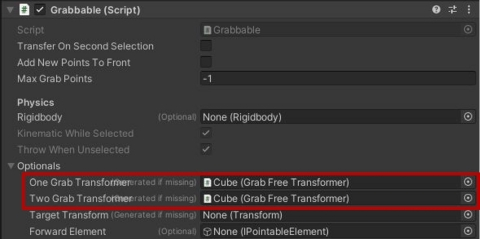

# MetaQuestでオブジェクトをつかむ（準備編）

## 0. 本記事の内容

Meta Questで3Dオブジェクト（立方体）をつかんで操作する方法の紹介を開始します。VRやARにおいて一言でオブジェクトをつかむと言っても、そのオブジェクトが近くにある場合と遠くにある場合とで必要な設定が異なります。

本連載ではそれぞれの場合について実現方法を紹介しますが、その準備段階として本記事では各場合に共通して必要になる設定について解説します。この記事を完了することで、オブジェクトマニピュレーションの基盤が整います。

  
*この動画はAR版ですがAR/VR両対応です  
*本記事の内容は準備編のためこの内容のみでは動画のようなマニピュレーションは行えません

なお本記事は下記で作成したVRまたはARのシーンで表示している立方体を操作することを前提としています。立方体に特別なコンポーネントが追加されていない、Questで眺めるだけの状態からのスタートとなりますので、他のプロジェクトでも同様の状況であれば本記事と続きの記事の内容を実践することでオブジェクト操作を実現できます。

**[VR版]**

[MetaQuestでオブジェクトを表示](2-quest-vr-object-display.md)

**[AR版]**

[MetaQuestのパススルーを使ったAR表示](3-quest-ar-passthrough.md)

## 1. シーンの複製

前回の記事で作成したシーンを編集することも可能ですが、この既存のシーンを破壊せずにマニピュレーションを試すため、シーンを複製する方法を紹介します。不要な場合は読み飛ばしてください。

- 前回までに作成したVR版またはAR版のシーンを開く
- **File -> Save As...** をクリックして現在のシーンを新しい名前で保存  
  *本記事では**Manipulation**とします
- Hierarchyに表示されるシーン名がManipulationになっていることを確認

## 2. オブジェクトの接触検知を有効化

オブジェクトをつかんで操作するには手やコントローラとオブジェクトとの接触を検知する必要があります。ここで解説するオブジェクトとの接触検知に関する手順は、Quest開発に限らずUnityでの開発に共通する内容となります。

**[Colliderの確認]**

- Hierarchyで操作対象のオブジェクト（**Cube**）を選択
- Inspectorで表示されるCubeの詳細情報に**BoxCollider**が適用されていることを確認  
  *Cube以外のオブジェクトの場合は、各オブジェクトに合わせたColliderを使用  
  *自作のモデルの場合は手作業でColliderを追加

**[Rigidbodyの追加と設定]**

- Inspector下方の**Add Component**ボタンをクリック
- 検索領域に**Rigidbody**と入力
- 表示された候補の中から**Rigidbody**を選択
- InspectorにRigidbodyが追加されたことを確認し、下記のように変更

| 設定項目 | 設定値 | 説明 |
|----------|--------|------|
| **Use Gravity** | OFF | 重力の影響を無効化 |
| **Is Kinematic** | ON | 物理演算を無効化 |

**重要：** 接触検知にはColliderとRigidbodyが必要になるので、必ず対象となるオブジェクトにセットしてください。

## 3. つかんで操作できる属性の追加

ここではつかめるようにする、移動可能にするという2種類の属性を追加します。

**[Grabbableコンポーネントの追加]**

- HierarchyでCubeを選択
- **Add Component**をクリック後、**Grabbable**で検索
- 候補の中から**Grabbable**を選択

**[Grab Free Transformerの追加]**

- CubeのInspectorで**Add Component**をクリック
- **Grab Free**で検索
- 候補の中から**Grab Free Transformer**を選択  
  *手やコントローラでつかまれた際に、移動・回転・スケール変更を可能にするスクリプト  
  *細かく設定することで移動や回転の制約を設けることも可能  
  *他にも、回転のみを制限するOne Grab Rotate Transformerなどもあるので興味があればTransformerのキーワードで検索

**[片手操作の設定]**

- Grabbable内の**Options**を開く
- **One Grab Transformer**の右側のエリアに**Cube**をドラッグ&ドロップ  
  *この操作によりCubeに追加したGrab TransformerがGrabbableスクリプトに登録され、片手でつかんでオブジェクトを動かす準備が完了

**[両手操作の設定]**

*片手のみで良い場合は読み飛ばしてください*

- Grabbable内の**Options**を再度開く
- **Two Grab Transformer**の右側のエリアに**Cube**をドラッグ&ドロップ  
  *この操作によりCubeに追加したGrab TransformerがGrabbableスクリプトに登録され、両手でつかんでオブジェクトを動かす準備が完了
- Grabbableのオプションが下記のようになっていればOK

**[スケール変更の設定（オプション）]**

両手で操作をする際にオブジェクトのスケールを変更したい場合は下記の設定も行ってください。

- CubeのInspectorで**Grab Free Transformer**に注目
- **Scale Constraints**を開く
- X, Y, Z AxisのConstraintの**チェックをすべて外す**

## 4. 次のステップ

ここまでの操作でコントローラや手につかまれた場合にオブジェクト（Cube）の位置・角度・スケールが変更されるという設定が完了しました。

しかし現状ではまだオブジェクトを操作できません。なぜなら冒頭にも説明した通り、オブジェクトとコントローラや手の遠近によって要求される設定が異なるため、これらに関する設定をまだ行っていないからです。さらに、つかむ際にコントローラと手のどちらを（もしくは両方を）使うのかについての設定も行っていません。

次の記事では遠近それぞれの場合についての設定方法を紹介します。

**[近くのオブジェクト編]**

[MetaQuestで近くにあるオブジェクトをつかむ](6-quest-near-object-grab.md)

**[遠くのオブジェクト編]**

[MetaQuestで遠くにあるオブジェクトをつかむ](7-quest-far-object-grab.md)

## 5. Meta XR SDKに関する記事一覧はこちら

[Meta XR SDK連載目次](0-main.md)
