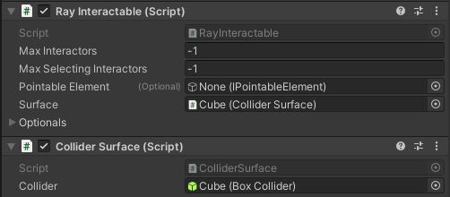
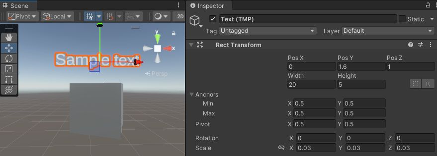
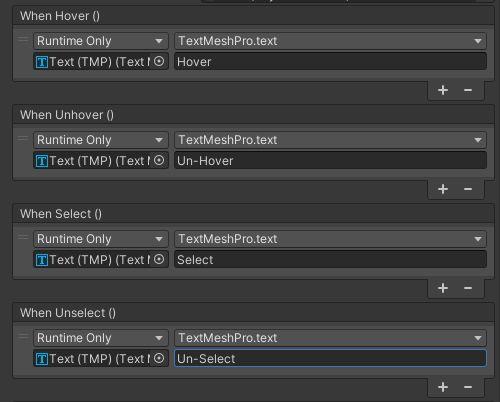

# MetaQuestでRayインタラクション

## 0. 本記事の内容

今回はMeta Questでコントローラや手から出るポインタ(Ray)とのインタラクションについてです。具体的にはRayを用いたHover(ポインティング)や選択(クリック)の検出を実現する手順について紹介します。  
GitHubで公開している[サンプル](https://github.com/TakashiYoshinaga/MetaXR-SDK-Samples)の04-RayInteractionまたは04-RayInteraction-ARシーンでも動作を確認できます。

  
*この動画はAR版ですがAR/VR両対応です。

なお本記事は下記で作成したVRまたはARのシーンで表示している立方体を操作することを前提としています。立方体に特別なコンポーネントが追加されていない、Questで眺めるだけの状態からのスタートとなりますので、他のプロジェクトでも同様の状況であれば本記事と続きの記事の内容を実践することでオブジェクト操作を実現できます。

**[VR版]**

[MetaQuestでオブジェクトを表示](https://tks-yoshinaga.hatenablog.com/entry/quest-dev-vr)

**[AR版]**

[MetaQuestのパススルーを使ったAR表示](https://tks-yoshinaga.hatenablog.com/entry/quest-dev-ar)

## 1. シーンを複製

上記の記事で作成したシーンを編集することも可能ですがこの章では、この既存のシーンを破壊せずにRayインタラクションを試すため、シーンを複製する方法を紹介します。不要な場合は読み飛ばしてください。

- 上記の記事で作成したVR版またはAR版のシーンを開く
- File -> Save As... をクリックして現在のシーンを新しい名前で保存  
  *本記事ではRayInteractionとします
- Hierarchyに表示されるシーン名がRayInteractionになっていることを確認

## 2. オブジェクトとRayの交差検知を有効化

Rayとの相互作用を実現するため、オブジェクトにRayとの相互作用を検出するスクリプトを追加します

- Hierarchyで操作対象のオブジェクト(Cube)を選択
- Inspectorで表示されるCubeの詳細情報に**BoxCollider**が適用されていることを確認  
  *Cube以外のオブジェクトの場合は、各オブジェクトに合わせたColliderを設定  
  *自作のモデルの場合は手作業でColliderを追加
- Inspector下方のAdd Componentボタンをクリック
- 検索領域に**Interactable**と入力
- 表示された候補の中から**Ray Interactable**を選択

追加されたRay Interactableを確認するとSurfaceの項目がNoneとなっています。この項目はRayとの交差を判定するための形状をRay Interactableに登録するので必須となります。

- CubeのInspectorの下方のAdd Coponentをクリック
- Colliderで検索し、**Collider Surface**を選択
- Collider SurfaceにCubeをドラッグ&ドロップ  
  *Cubeのコライダーの形状を交差判定のための形状として使用
- **RayInteractable**のSurfaceにCubeをドラッグ&ドロップ  
  *上記で作成した形状情報(Surface)をRayInteractableに登録

## 3. Rayとのインタラクションのイベント取得

上記の操作によりRayとのインタラクションを行う準備ができたので、Hover(ポインティング)や選択(クリック)をイベントとして受け取る機能を追加します。

- HierarchyでCubeを選択
- CubeのInspectorの下方のAdd Coponentから**Interactable**で検索
- **Interactable Unity Event Wrapper**を選択
- Interactable Unity Event Wrapperの**Interactable View**にCubeをドラッグ&ドロップ  
  *Ray Interactableを登録し、HoverやSelectのイベントの発火につなげる

## 4. Rayインタラクションの動作確認

実際にイベントを受け取って動作を確認します。本記事ではHoverやSelectの状態をテキストで表示します。

- Hierarchyの空白を右クリック
- 3D Object -> Text - TextMeshProをクリック  
  *TextMeshProが未インストールの場合はダイアログの案内に沿ってTextMeshProをインストール。(サンプルのインストールは不要)
- Inspectorで下記のようにText(TMP)の設定を変更しCubeの上にテキストを表示

- Inspector内のTextMeshPro-Textに注目
- Alignmentで文字の位置を中央寄せに変更
- CubeをクリックしてInspectorの**Interactable Unity Event Wrapper**に注目
- **WhenHover**の右下の **+** をクリック
- **None**と書かれた領域にText(TMP)をドラッグ&ドロップ
- NoFunction書かれたドロップダウンメニューを開く
- **TextMeshPro -> string text**をクリック
- ドロップダウンメニューの下に表示されるテキストエリアにHover開始時に表示したいテキストを入力(例: Hover)

- 上記の操作でHover(ポインティング)開始時にHoverと表示されるようになります。同じ要領で下記のイベントで表示するテキストを設定  
  **When Unhover() :** Un-Hover  
  **When  Select() :** Select  
  **When Unselect() :** Un-Select

動作確認をすると冒頭に掲載した動画のようにRayの交差開始と終了時にHverまたはUn-Hover、指でのピンチまたはコントローラのトリガー押下の開始・終了時にはSelect、Un-Selectと表示されます。

## 5. Meta XR SDKに関する記事一覧はこちら

[はじめようMeta XR SDKでQuestアプリ開発](https://tks-yoshinaga.hatenablog.com/entry/quest-dev-index)